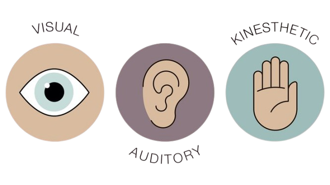

# VAK Learning Style Classifier



**VAK Learning Style Classifier** is an interactive web application that predicts a user's learning style—Visual, Auditory, or Kinesthetic—based on sentences describing their learning preferences. Built with Streamlit and powered by a machine learning model, this app helps users discover their dominant learning style and provides tailored tips to enhance their learning experience.

Try it live: [VAK Learning Style Classifier](https://3maali-w5cunvfrkzykedebxtpsyz.streamlit.app/)

---

## 📖 About the Project

The VAK model categorizes learners into three styles:
- **Visual**: Learners who prefer images, diagrams, and written information.
- **Auditory**: Learners who excel through listening to lectures or discussions.
- **Kinesthetic**: Learners who thrive with hands-on activities and movement.

This project uses a **Logistic Regression** model trained on a dataset of labeled sentences to predict the learning style from user input. The app achieves a test accuracy of **95.15%** and provides a detailed analysis, including prediction confidence and a word cloud visualization of the input text.

### Features
- **Predict Learning Style**: Enter one or more sentences describing how you learn, and the app predicts your dominant learning style.
- **Confidence Scores**: View the model's confidence for each learning style (Visual, Auditory, Kinesthetic).
- **Word Cloud**: Visualize key words from your input in an interactive word cloud.
- **Learning Tips**: Receive personalized tips based on your predicted learning style to optimize your study habits.
- **Sample Sentences**: Get suggested sentences for each learning style to guide your input.
- **Model Details**: Explore the machine learning model, including its implementation and performance metrics.

---

## 🎥 Demo

Visit the live app: [VAK Learning Style Classifier](https://3maali-w5cunvfrkzykedebxtpsyz.streamlit.app/)

Here’s a quick look at the app’s interface:


*(Replace `screenshot.png` with an actual screenshot of your app for better visuals.)*

---

## 🛠️ Technologies Used

- **Python 3.8+**: Core programming language.
- **Streamlit**: For building the interactive web interface.
- **NLTK**: For text preprocessing (tokenization, stopword removal, lemmatization).
- **scikit-learn**: For the Logistic Regression model, TF-IDF vectorization, and label encoding.
- **WordCloud & Matplotlib**: For generating and displaying word clouds.
- **Joblib**: For saving and loading the trained model and vectorizer.
- **Pillow**: For image processing in word clouds.

---

## 🚀 How to Use

1. **Visit the App**: Open the [live app](https://3maali-w5cunvfrkzykedebxtpsyz.streamlit.app/).
2. **Enter Sentences**: In the "Predict Learning Style" tab, type one or more sentences describing how you learn (e.g., "I learn best by watching videos and diagrams").
3. **Get Suggestions**: Use the sidebar buttons to view sample sentences for Visual, Auditory, or Kinesthetic styles.
4. **Predict**: Click the "Predict" button to see your dominant learning style, confidence scores, word cloud, and tailored learning tips.
5. **Explore Model Details**: Switch to the "Model Details" tab to learn about the machine learning model and its performance.

### Example Sentences
- "I learn best by watching videos and diagrams." (Visual)
- "I prefer listening to lectures or podcasts." (Auditory)
- "I enjoy hands-on activities and experiments." (Kinesthetic)
- "I find it helpful to draw sketches to understand ideas." (Visual)
- "I learn better by teaching others or explaining aloud." (Auditory)

---

## 🧠 Machine Learning Model

The app uses a **Logistic Regression** model trained on a dataset of labeled sentences (`dataset.csv`). Key details:

- **Preprocessing**: Text is converted to lowercase, punctuation is removed, stopwords are filtered, and words are lemmatized using NLTK.
- **Feature Extraction**: A TF-IDF Vectorizer transforms text into numerical features (max 1000 features).
- **Training**: The model is trained on 80% of the data, with 20% reserved for testing (stratified split).
- **Performance**: Achieves **95.15% accuracy** on the test set (3090 samples). See the classification report below:

| Learning Style | Precision | Recall | F1-Score | Support |
|----------------|-----------|--------|----------|---------|
| Auditory       | 0.98      | 0.94   | 0.96     | 961     |
| Kinesthetic    | 0.97      | 0.93   | 0.95     | 964     |
| Visual         | 0.92      | 0.98   | 0.95     | 1165    |
| **Macro Avg**  | 0.96      | 0.95   | 0.95     | 3090    |
| **Weighted Avg** | 0.95    | 0.95   | 0.95     | 3090    |

---

## 📦 Installation and Setup

To run the app locally, follow these steps:

### Prerequisites
- Python 3.8 or higher
- Git (optional, for cloning the repository)

### Steps
1. **Clone the Repository** (if hosted on GitHub):
   ```bash
   git clone https://github.com/your-username/vak-learning-style-classifier.git
   cd vak-learning-style-classifier
