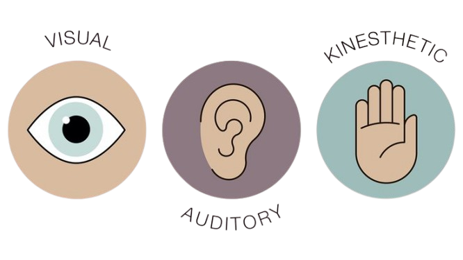

# VAK Learning Style Classifier



Interactive web app to predict your learning style (Visual, Auditory, Kinesthetic) using a machine learning model. Built with Streamlit.

Live Demo: [VAK Learning Style Classifier](https://3maali-w5cunvfrkzykedebxtpsyz.streamlit.app/)

## About
Predicts learning style from sentences using an **XGBoost model with BERT embeddings** (70.20% accuracy). Features include:
- Predict dominant learning style
- Confidence scores
- Word cloud visualization
- Personalized learning tips
- Sample sentences
- Model details

## Technologies
- Python 3.10+
- Streamlit
- NLTK
- scikit-learn
- transformers (BERT)
- torch (PyTorch)
- xgboost
- WordCloud, Matplotlib
- Joblib
- Pillow

---
## How to Use
1. Visit [live app](https://3maali-w5cunvfrkzykedebxtpsyz.streamlit.app/)
2. Enter sentences (e.g., "I learn best by watching videos")
3. Click "Predict" for results and tips
4. Check "Model Details" for ML info

## Example Sentences
- "I learn best by watching videos and diagrams." (Visual)
- "I prefer listening to lectures or podcasts." (Auditory)
- "I enjoy hands-on activities and experiments." (Kinesthetic)

## Model
- **Type**: XGBoost with BERT embeddings
- **Data**: Labeled sentences (`dataset.csv`)
- **Preprocessing**:
  - Lowercase, remove punctuation, stopwords (NLTK)
  - Custom stopwords removal (e.g., 'learn', 'understand', 'better')
  - BERT embeddings (`bert-base-uncased`, 768-dimensional vectors)
- **Training**:
  - Balanced dataset using resampling
  - 80/20 train-test split with stratification
  - XGBoost with 200 estimators
- **Accuracy**: 70.20% (2883 test samples)

## Setup
1. Clone repo: `git clone https://github.com/your-username/vak-learning-style-classifier.git`
2. Create virtual env: `python -m venv venv && source venv/bin/activate`
3. Install dependencies: `pip install -r requirements.txt`
4. Download NLTK data:
   ```python
   import nltk
   nltk.download(['punkt', 'stopwords', 'punkt_tab'])
